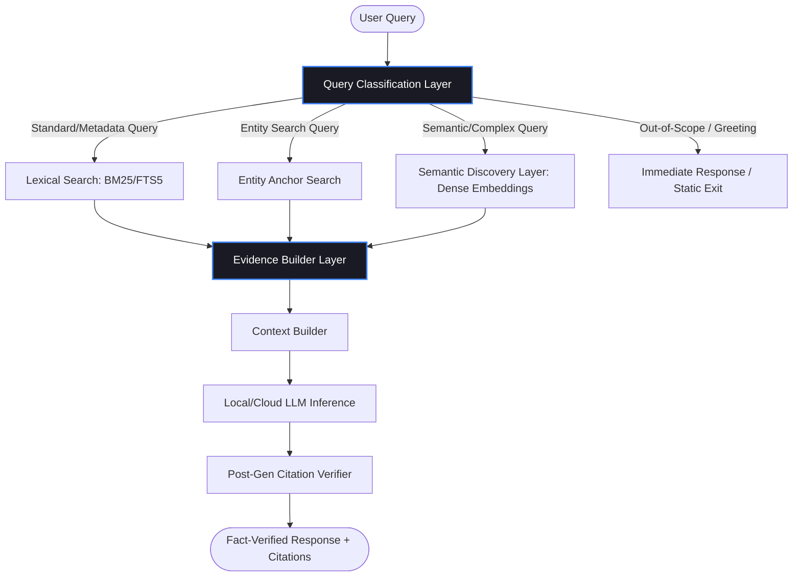

# Phase 3 AI Architecture Blueprint — SiddhaVerse

## Document Information
- **Role**: Lead Systems Architect  
- **System Version**: v3.1-RC2 (Refined Architecture)  
- **Target Scale**: 100,000+ documents (verses + supporting metadata)  
- **Core Principle**: Evidence-Backed Synthesis (Strict Zero-Hallucination Threshold)  

---

## 1. Architectural Vision and Goals

The SiddhaVerse AI Retrievable Knowledge Assistant is designed not as a generic conversational chatbot, but as an **evidence-based scholarly research tool**. To preserve the academic and traditional integrity of the Siddha corpus, the architecture prioritizes strict factual accuracy over linguistic creativity.

### Core Architectural Goals:
1. **Absolute Traceability**: Every statement generated by the system must be directly traced to specific source verses and metadata documents.
2. **Zero-Hallucination Boundary**: The system must refuse to answer queries that fall outside the semantic scope of the corpus, or when matching evidence is below the confidence threshold.
3. **Scholarly Integrity**: Classical Tamil text must remain the ground truth. Romanized transliterations and English translations are treated as supplementary retrieval vectors.
4. **Scalability to 100,000+ Documents**: The design assumes the corpus will scale from the current 1,174 files to 100,000+ documents. Memory footprints, indexing pipelines, and query latencies must scale sub-linearly.

---

## 2. Refined System Topology

SiddhaVerse employs a **Hybrid retrieval-augmented generation (RAG) topology**. It introduces a **Query Classification Layer** at ingestion and an **Evidence Builder Layer** before LLM generation to maximize precision and minimize resource overhead.

---

## 3. Query Classification Layer

To optimize performance and reduce computational latency at scale, a lightweight classification layer evaluates every incoming query before calling the retrieval engines.

### Intent Categorization:
Queries are classified into one of nine distinct categories. Depending on the category, the system routes the query to the most efficient retrieval subsystem, bypassing resource-heavy vector similarity searches when lexical or direct primary-key matching suffices.

| Query Category | Intent / Example | Target Routing | Vector Bypass |
| :--- | :--- | :--- | :--- |
| **Verse Lookup** | "Thirumandiram verse 127" | SQL Metadata Search by `verse_number` & `source_work` | **YES** |
| **Siddhar Biography** | "Who was Bogar?" | Direct lookup of `siddhar_bogar.json` | **YES** |
| **Medicinal Plant** | "Medicinal properties of Nilavembu" | Direct lookup of `plant_nilavembu.json` | **YES** |
| **Formulation** | "What is Kabasura Kudineer?" | Direct lookup of `formulation_kabasura_kudineer.json` | **YES** |
| **Philosophy** | "What is the concept of Maya in Siddha?"| Hybrid (FTS5 + Semantic Discovery) | NO |
| **Sacred Place** | "Verses mentioning Chidambaram" | SQL Entity lookup (`place_chidambaram`) | **YES** |
| **Research Article** | "Studies on clinical trials of Tulsi" | SQL + FTS5 search on `pubmed_` prefix files | **YES** |
| **Greeting / Conversation**| "Hello, how can you help me?" | Redirects to a static response template | **YES** |
| **Out-of-Scope** | "Explain the theory of relativity" | Immediate exit: Static refusal template | **YES** |

---

## 4. Evidence Builder Layer

The **Evidence Builder Layer** acts as the analytical gatekeeper between raw retrieval outcomes and prompt assembly. It ingests the raw, unfiltered candidate records from the search engines and refines them into a consolidated **Evidence Package** for prompt context.

### Responsibilities:
1. **Deduplication**: Resolves duplicate retrieval segments (e.g., if FTS5 and vector search return the same verse document node, the Evidence Builder consolidates them into a single node).
2. **Prioritization of Primary Sources**: Prioritizes primary textual sources (classical verses like *Thirumandiram* and *Sivavakkiyam*) over secondary metadata documents (biographies, plant records, or scientific papers) in context ranking.
3. **Order Preservation**: Maintains the rank sequence of retrieved items based on unified RRF and cross-encoder relevance scores.
4. **Metadata Augmentation**: Attaches crucial validation tags to each segment (`document_id`, `content_hash`, `author`, `source_work`, `license`) to facilitate citation generation.
5. **Token Budget Enforcement**: Restricts context sizes to fit within strict boundaries (e.g., maximum 4,000 tokens for context). If the retrieved set exceeds the budget, the Evidence Builder trims secondary sources first, ensuring that primary verses are preserved.
6. **Fact Structure Packaging**: Formats the final list into a clean, markdown-demarcated structure ready for LLM processing.

---

## 5. Scholarly Citation Boundaries

To enforce academic credibility, the LLM is constrained by a strict sandbox environment:

1. **Document Injection Limits**: Chunks injected into the prompt context must contain the absolute source mapping (file hashes and record identifiers).
2. **Strict Generation Guardrails**: The LLM is instructed via system prompts to use a structured schema for citations (e.g., `<cite doc="doc_id" hash="content_hash" />`).
3. **Programmatic Post-Filtering**: The backend parses the LLM output, extracts the `<cite>` tags, and matches them against the injected context hashes. Any citation generated by the LLM that was not present in the retrieved context triggers an immediate system-level fallback ("Evidence not found in corpus").

---

*Walkthrough and design verified for SiddhaVerse production standards.*
