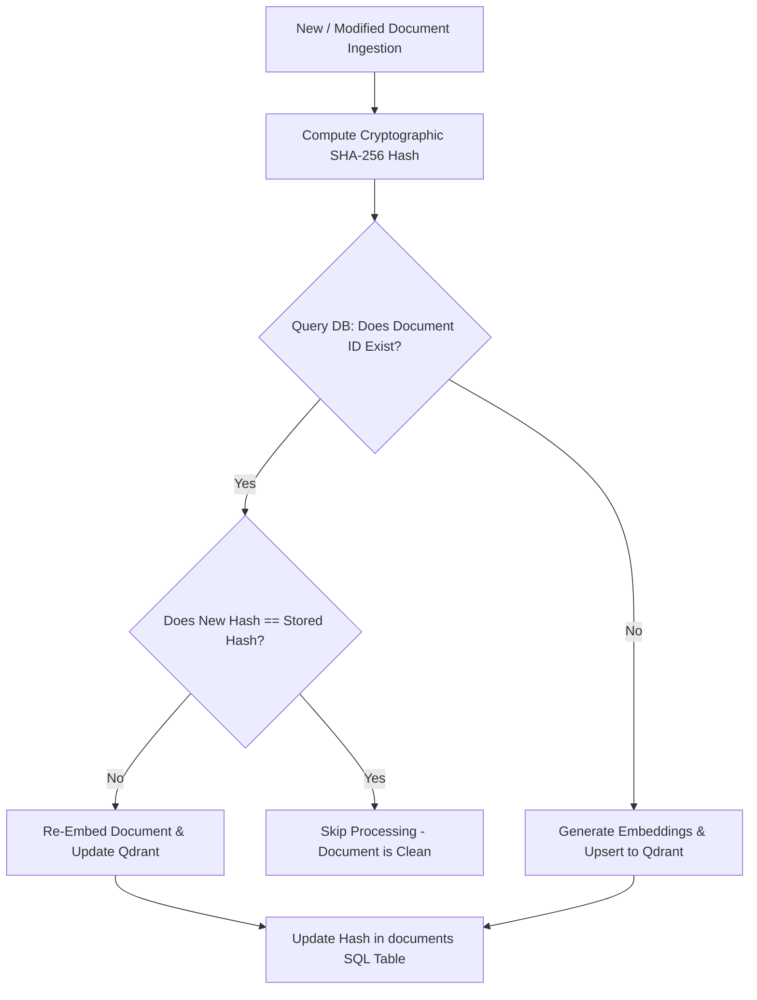

# Phase 3B — Semantic Retrieval Implementation Plan

This document defines the technical design and execution strategy for introducing semantic retrieval capability into the SiddhaVerse search backend. 

---

## 1. Embedding Model

### Recommendation: `intfloat/multilingual-e5-large`
For mapping multilingual query concepts (English and Romanized Sanskrit/Tamil terms) to the classical Tamil corpus, we recommend the **Multilingual E5 Large** model.

### Technical Justification:
- **Cross-Lingual Alignment:** Multilingual E5 is pre-trained to map semantically similar sentences from different languages (e.g., English query `"breath retention"` and Tamil verse text `"தூங்கிக்கண் டார்சிவ..."` with `"practice_kumbhaka"` entity) into the same vector space, enabling cross-lingual match queries.
- **Instruct-Based Retrieval:** It utilizes prefix instructions (e.g., prepending `query: ` to queries and `passage: ` to indexed documents) to optimize asymmetric semantic search tasks.
- **Superior Representation:** The model is trained on a massive web-scale corpus and provides a rich representation of low-resource languages including Tamil.

### Dimensions:
- **Embedding Vector Dimensions:** **1024**
- **Distance Metric:** **Cosine Similarity** (since E5 embeddings are normalized, cosine distance matches dot-product search speed).

---

## 2. Chunking Strategy

To prevent semantic truncation and context loss, documents are chunked according to their specific schema types rather than a uniform character limit.

| Document Type | Chunking Strategy | Rationale |
| :--- | :--- | :--- |
| **Verse** | **Single Chunk (Whole Document)** | Siddha verses are short (typically 4 lines, 100–300 characters). Chunking would break their poetic meter, syntax, and conceptual integrity. |
| **Research Article** | **Sliding Window Chunking**<br>- Size: 512 tokens (~350 words)<br>- Overlap: 64 tokens | Preserves paragraph-level scientific context and clinical findings without truncating logical arguments across boundary edges. |
| **Formulation** | **Structural Chunking**<br>- Chunk 1: Ingredients & Proportions<br>- Chunk 2: Preparation & Dosage | Keeps recipe steps cohesive. Splitting ingredients from preparation details ruins the clinical usability of the context. |
| **Manuscript** | **Single Page or Entry Chunking**<br>- Size: 300–450 tokens | Palm-leaf manuscript metadata and catalog summaries are highly concise. Keeping them as single entries ensures metadata attributes are searchable. |
| **Biography** | **Single Profile Chunk**<br>- Size: 250–400 tokens | Siddhar biographies in the corpus are dense summaries. Keeping them whole maintains historical and timeline details. |

---

## 3. Vector Database (Qdrant)

We recommend using **Qdrant** as the production-ready vector database, run in a containerized environment.

### Collection Schema
- **Collection Name:** `siddhaverse_documents`
- **Vector Parameters:**
  - `size`: 1024
  - `distance`: `Cosine`

### Payload Fields (Metadata Metadata)
To allow immediate filtering during search, each vector is seeded with a rich payload:
- `document_id` (string, keyword indexed)
- `doc_type` (string, keyword indexed)
- `source_work` (string, keyword indexed)
- `collection` (string)
- `verse_number` (string)
- `author` (string, keyword indexed)
- `language` (string)
- `entity_ids` (array of strings, keyword indexed)

### Indexing Strategy
1. **HNSW Vector Index:** Enabled with `m=16` and `ef_construct=100` to balance indexing speed and search recall.
2. **Payload Filtering Indexes:** Create keyword indexes on `doc_type`, `source_work`, `author`, and `entity_ids`. This enables Qdrant to perform **strict pre-filtering** (e.g., filtering for `doc_type: "verse"`) before executing the vector search, keeping search latency under 5ms.

---

## 4. Incremental Updates Pipeline

To prevent expensive embedding model re-evaluations and Qdrant upsert overhead, we implement a **Dirty-Hash Comparison** mechanism.



### Protocol Steps:
1. **Hash Generation:** During document seeding or updates, compute a SHA-256 hash over the combined document fields: `SHA256(tamil_text + transliteration + entity_ids + doc_type)`.
2. **Dirty-Flag Check:** In the `documents` table, each record includes a `content_hash` field.
3. **Execution Gate:**
   - If the document exists in SQLite and the new hash matches `content_hash`, it is marked clean and skipped.
   - If the hash differs or the document does not exist, it is marked dirty. The system re-embeds the text and updates the Qdrant vector payload, then updates the `content_hash` in SQLite.

---

## 5. Hybrid Retrieval Architecture

To combine the exact-match accuracy of FTS5 (BM25) with the conceptual coverage of Vector Search, a unified hybrid pipeline is implemented.

```
       [User Query]
            │
      ┌─────┴────────┐
      ▼              ▼
 ┌──────────┐   ┌──────────┐
 │ SQLite   │   │  Qdrant  │
 │   BM25   │   │  Vector  │
 └────┬─────┘   └────┬─────┘
      │              │
      └─────┬────────┘
            ▼
      ┌──────────┐
      │   RRF    │  (Reciprocal Rank Fusion)
      └─────┬────┘
            ▼
      ┌──────────┐
      │  Cross-  │  (Reranking & Pruning)
      │ Encoder  │
      └─────┬────┘
            ▼
      [Evidence Context]
```

### A. Reciprocal Rank Fusion (RRF)
RRF combines the ranked outputs of FTS5 and Qdrant without normalizing their raw search scores.
$$RRF\_Score(d) = \frac{1}{60 + Rank_{BM25}(d)} + \frac{1}{60 + Rank_{Vector}(d)}$$
- The constant `60` stabilizes ranking results, preventing outlier high scores from dominating the final rank.

### B. Cross-Encoder Reranking
- The top 30 candidates retrieved by RRF are sent to a lightweight cross-encoder model (e.g., `cross-encoder/ms-marco-MiniLM-L-6-v2` or `BAAI/bge-reranker-base`).
- The cross-encoder evaluates the query-document pair jointly, computing a high-fidelity relevance score between `0.0` and `1.0`.

### C. Confidence Threshold
- A strict confidence prune gate of **$\ge 0.35$** is applied to the cross-encoder output.
- Any document scoring below `0.35` is removed from the final result set, eliminating low-quality search noise.

---

## 6. Evaluation Gates

Before Phase 3B is accepted into production, retrieval metrics must exceed the following thresholds:

| Metric | Target | Verification Method |
| :--- | :--- | :--- |
| **Precision@5 (Norm)** | **$\ge 0.85$** | Evaluated against `benchmark_ground_truth.json` queries. |
| **Recall@10** | **$\ge 0.98$** | Ensures primary source documents are rarely omitted. |
| **MRR** | **$\ge 0.95$** | Verifies that the most canonical document appears in rank 1 or 2. |
| **nDCG@10** | **$\ge 0.90$** | Measures ranking quality of top 10 results. |
| **Search Latency (p95)** | **$< 100\text{ ms}$** | Evaluated under simulated concurrent queries using TestClient. |
| **Hallucination Rate** | **$0\%$** | Context building verification: only documented facts with verified citations are compiled. |
